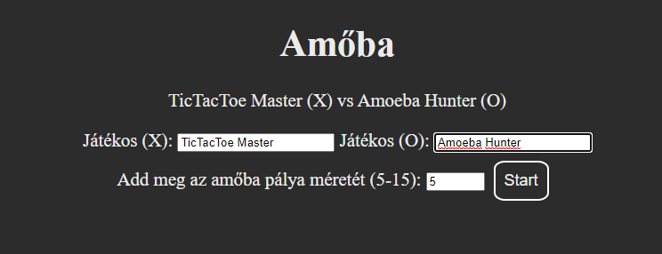
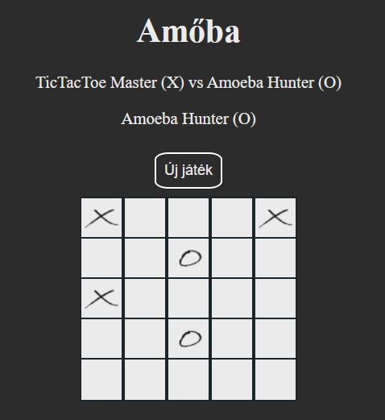

# Klasszikus amőba játék

A játék online elrhető: [https://greytictactoe.herokuapp.com/]
A játékot két személy játszhatja, egy böngészőben. A játék kezdetekor add meg a pálya méretét (minimum 5x5 - maximum 15x15), illetve a játékosok nevét.
A játék addig tart, amíg valamelyik játékos nem foglal el 5 egymás mellett lévő mezőt (horizontálisan, vertikálisan vagy átlósan). A játék alatt a mező fölött látható, hogy ki következik. A játékot az "Új játék" gombbal megszakíthatjuk.
A játék végén a mező fölött megjelenik a győztes neve (vagy döntetlen), az "Új játék" gombbal pedig kezdődhet a visszavágó.

## Felhasznált technológiák

HTML, CSS, React.js

## A kód futtatása

A projekt mappájában futtasd:

### `npm start`

Fejlesztői módban fut a játék.\
Nyisd meg a [http://localhost:3000](http://localhost:3000) -t hogy lásd a jétkot a böngészőben.
